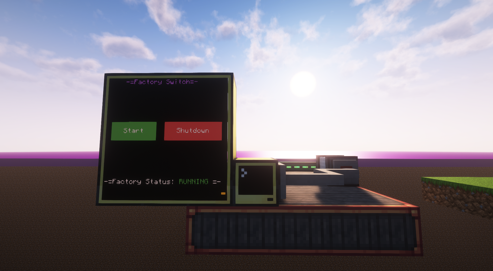
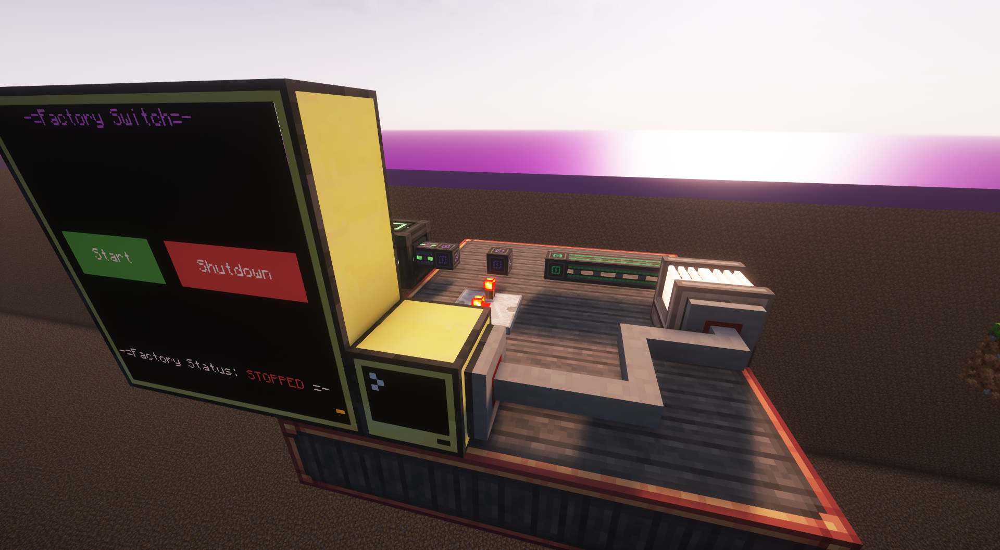
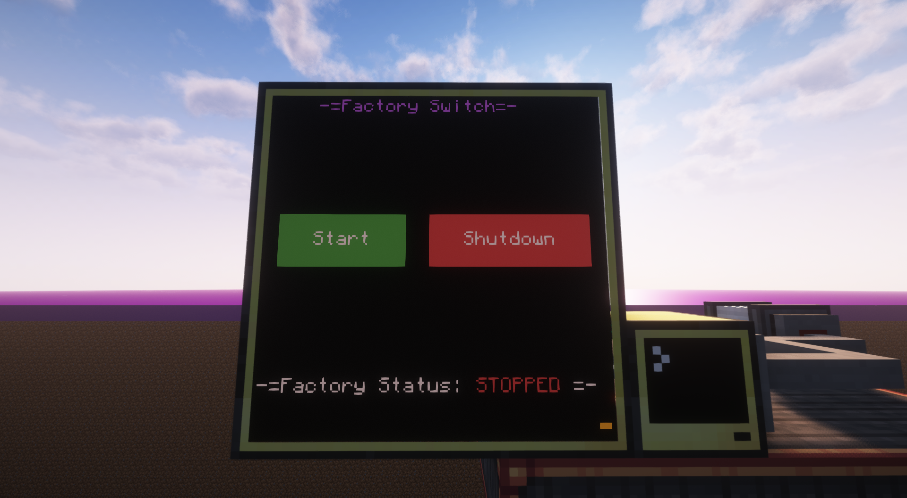
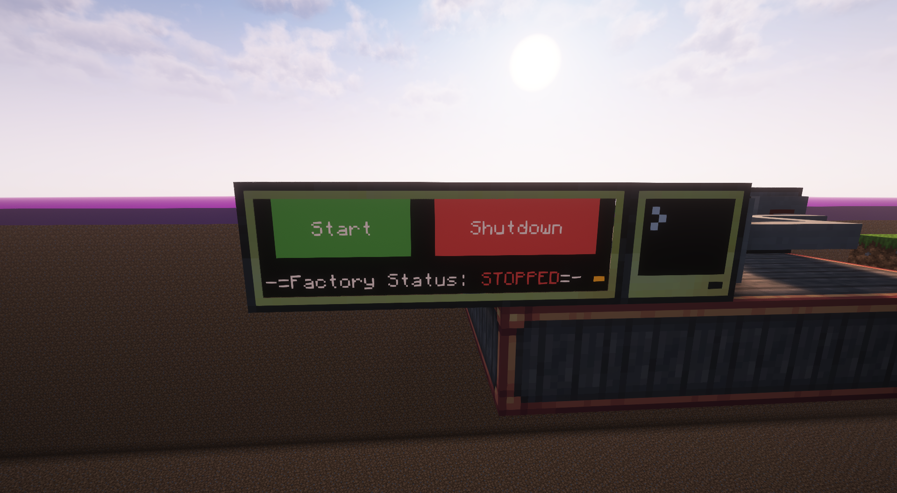
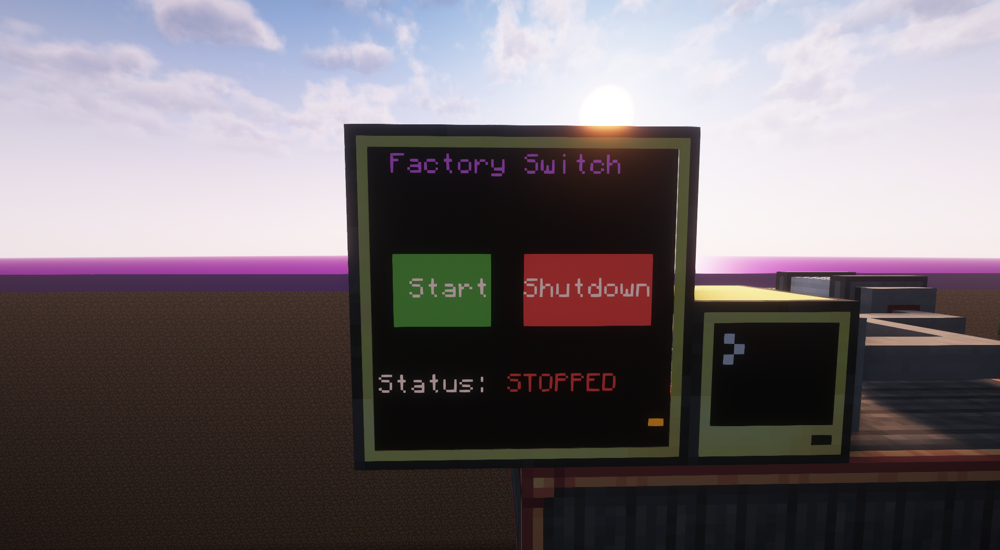

# Factory On-Off Switch
## Table of Contents

- [Factory On-Off Switch](#factory-on-off-switch)
  - [Table of Contents](#table-of-contents)
  - [Introduction](#introduction)
  - [Instructions](#instructions)
  - [Features](#features)
  - [Requirements](#requirements)
  - [Example Display](#example-display)
  - [Customisation](#customisation)
    - [Custom GUI Colours](#custom-gui-colours)
    - [Removing the Blinking Indicator](#removing-the-blinking-indicator)
    - [Drain the Power from the circuit using a resistive heater](#drain-the-power-from-the-circuit-using-a-resistive-heater)
    - [Change where the redstone is outputted from the computer.](#change-where-the-redstone-is-outputted-from-the-computer)

## Introduction

This script is used to enable or disable a power source by emitting a redstone signal when a button on a monitor is pressed.

## Instructions

1. Connect a computer to monitors, and optionally, a resistive heater.
   
2. Out of the back of the block- or whatever it is set to within ```Customisation.lua```, place some redstone, leading towards a wire.
  > [!NOTE]  
  > This systems works best by using lower-tier cables, when using the resistive heater to drain power. You could also add more resistive heaters, though this script does not support that out of the box.
3. Toggle redstone sensitivity for the wire by using a configurator.
   
4. Now, when you right click the monitor, it should toggle between the power states.
   

## Features

- **On/Off Switch**
- **Customisation**
- **Optional Power Drain Circuit**

## Requirements

- **3x3 Monitor**
> [!note]  
> Though designed for a 3x3 monitor, the script does work on monitors of varying dimensions.

## Example Display





## Customisation

### Custom GUI Colours

To change colours, simply change the variables located in ```Customisation.lua```.

```lua
ON_BUTTON_COLOUR = colors.green
OFF_BUTTON_COLOUR = colors.red
BACKGROUND_COLOUR = colors.black
```

### Removing the Blinking Indicator

To remove the blinking indicator at the bottom right of the screen, go
to the bottom of ```FactoryGUI.Lua``` and remove "Blink" from
```parallel.waitForAny```

### Drain the Power from the circuit using a resistive heater

To disable this, change "RESISTIVE_HEATER" in ```Customisation.lua``` to ```false```.

### Change where the redstone is outputted from the computer.

To change this, change "REDSTONE_OUTPUT_COMPUTER" in ```Customisation.lua``` to a direction, (Top, Back, etc).
