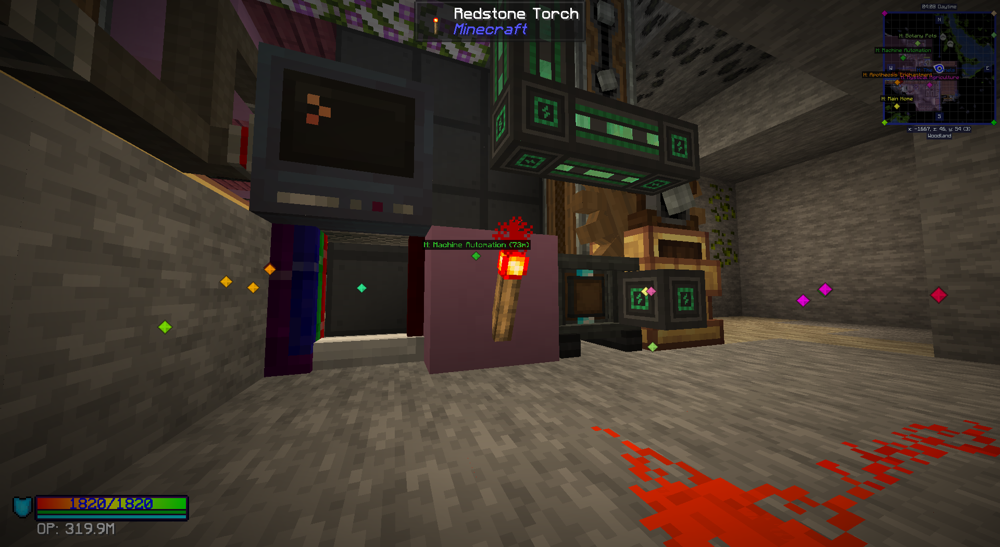
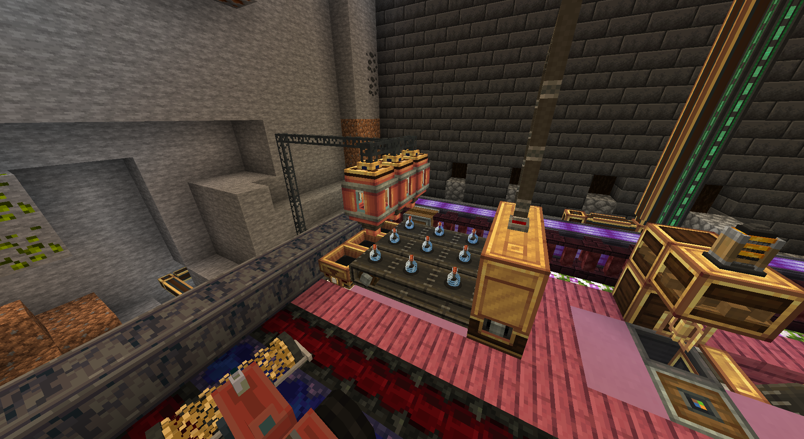

# Computercraft Scripts Repository
## Table of Contents

- [Computercraft Scripts Repository](#computercraft-scripts-repository)
  - [Table of Contents](#table-of-contents)
  - [Introduction](#introduction)
  - [Features](#features)
  - [Scripts Overview](#scripts-overview)

## Introduction

The following repository is a collection of small scripts that do various things. There are ReadMe's within each folder that describes what the scripts do.

## Features

- **PotionBottler**

## Scripts Overview

1. **PotionBottler**:
    - **Description**: Attach this script to a create tunnel, have a pattern provider connected to a spout and fill out the variables. If it detects a bottling recipe being crafted, it will export glass bottles to the tunnel to be used in bottling. It will also emit a wired signal, similar to that in the PotionAutoBrewing script, where it can turn off the circuits when not in use.

    
    
