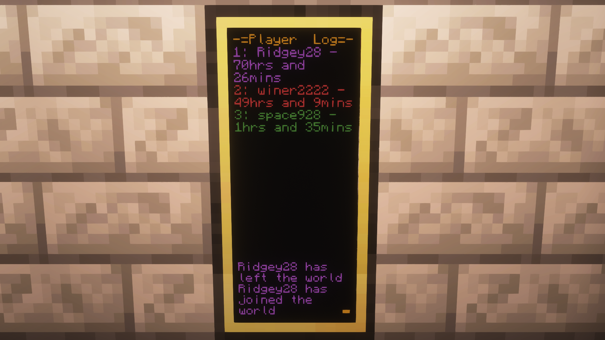

# Player Logger
## Table of Contents

- [Player Logger](#player-logger)
  - [Table of Contents](#table-of-contents)
  - [Introduction](#introduction)
  - [Features](#features)
  - [Requirements](#requirements)
  - [Example Display](#example-display)
  - [Customisation](#customisation)
    - [Custom Player Colours](#custom-player-colours)
    - [Changing Menu Colours](#changing-menu-colours)
    - [Change Logging Path](#change-logging-path)
    - [Removing the Blinking Indicator](#removing-the-blinking-indicator)

## Introduction

This script monitors players logging in and out, as well as keeping a written log at ```/logger/log.txt``` It also displays the top three players in terms of playtime, at the top of the monitor.

## Features

- **Player Logging Script**
- **Top Three Players**
- **Custom Colours for different players**

## Requirements

- **Advanced Peripherals - Player Detector**
- **1x2 Monitor**

## Example Display


## Customisation

### Custom Player Colours

To add more custom player colours, simply follow the template below:

```lua
["player_name"] = colors.here,
```

...and append it to the txtColor dictionary
shown below.

```lua
txtColor = {
    ["Ridgey28"] = colors.purple,
    ["winer2222"] = colors.red, 
    ["menu"] = colors.orange,
}
```

### Changing Menu Colours

Similarly to adding a custom player colour, to change the menu colour, simply replace the "colors.orange" with a colour of your choice, under
the "menu" key in the txtColor dictionary.

Changing this:

```lua
["menu"] = colors.orange
```

to this:

```lua
["menu"] = colors.yellow
```

makes ```-= Player Log=-``` to be yellow instead of orange.


### Change Logging Path

To change the logging path, change the path located within ```IOFile.lua``` under the ```PATH``` variable. 

```lua
PATH = "/logger/log.txt"
```

### Removing the Blinking Indicator

To remove the blinking indicator at the bottom right of the screen, go
to the bottom of ```PlayerLog.Lua``` and remove "Blink" from
```parallel.waitForAny```
