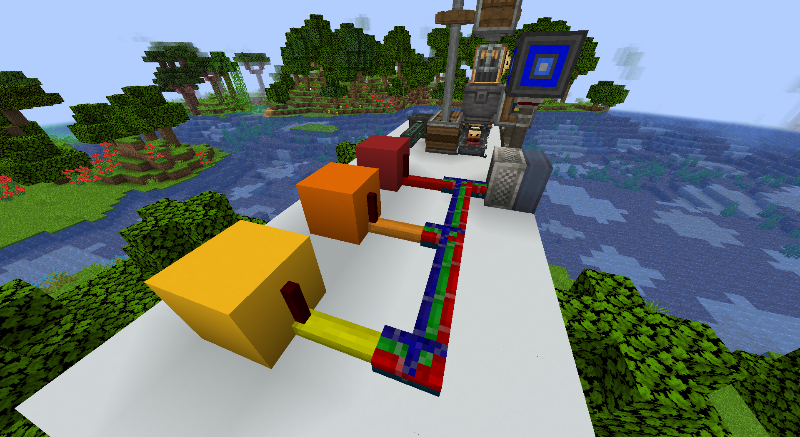

# AE2 Potion Autobrewer
## Table of Contents

- [AE2 Potion Autobrewer](#ae2-potion-autobrewer)
  - [Table of Contents](#table-of-contents)
  - [Introduction](#introduction)
  - [Features](#features)
  - [Requirements](#requirements)
  - [Instructions](#instructions)
    - [KubeJS:](#kubejs)
    - [Setting up Things:](#setting-up-things)
    - [Computer and Peripherals:](#computer-and-peripherals)
    - [Running the Script:](#running-the-script)
  - [Customisation](#customisation)
    - [Adding More Potions](#adding-more-potions)
      - [ME\_FRIENDLY\_POTIONS\_SERVER:](#me_friendly_potions_server)
      - [ME\_FRIENDLY\_POTIONS\_STARTUP:](#me_friendly_potions_startup)
      - [POTIONS:](#potions)
      - [POTIONSMAIN:](#potionsmain)
      - [CUSTOMISATION](#customisation-1)
        - [Before:](#before)
        - [After:](#after)
    - [Adding Items:](#adding-items)
    - [Disabling Potions](#disabling-potions)
      - [Before](#before-1)
      - [After](#after-1)
    - [Changing Timers for Specific Mods](#changing-timers-for-specific-mods)
    - [Adding More Chest Clusters](#adding-more-chest-clusters)
  - [Supported Mods:](#supported-mods)


## Introduction

This script is used to allow AE2 to autocraft potions using Create and export to and from peripherals.

## Features
- Autocrafting brewery using Create and AE2
- Custom potion fluids that can be filled back into vanilla potions using the Create spout.
- Support for other mods.

## Requirements
- **CC Bridge**
- **3 Wired/1 Block Modem**
- **Bundled Cable & Red Alloy Cable**
- **2x Redstone Link Per Node**
- **1 Basin, 1 Mixer, 1 Pattern Provider, 1 Chest per node.**
- **Universal Cable/General Power Cable**
- **Computer**
- **Some way of storing fluids in your ME**
- **Two Create funnels**
- **Blaze burner + straw**
  
## Instructions

> [!NOTE]   
> At the top of each script, remember to change the path. Ie, any `require` will need to be changed unless your code is within a folder called `PotionAutocrafting`. An example of a line to change is below:  
> 
> ```lua
> local Customisation = require("/PotionAutocrafting/Customisation")
> ```

### KubeJS:

1. Within KubeJSScripts, there are two scripts. These need to go in your KubeJS folder, with the javascript file titled ```ME_Friendly_Potions_Server``` to go into ```server_scripts``` and the one titled ```ME_Friendly_Potions_Startup``` to go into startup scripts.
2. You will know if you have done this right as if you type @KubeJS in JEI, there should be various potions available within the page, like "long liquid slowness potion"

### Setting up Things:
1. Get a basin, mixer, chest, two funnels, a blaze burner and a belt and set them up in a similar way to this. The blaze burner must constantly have lava. 


2. Off the back of the chest, or any side, attach a pattern provider. This will contain your recipes that the script depends on.

3. On one of the remaining sides of the basin, attach a modem, but the block variant. The small wired ones do not seem to work. Also attach a modem to a side of the chest, this can be a small one.


4. Set up a way to power your Create machines. How you do this does not matter, as long as it can be terminated using a redstone signal, normally I do it with a motor and a redstone sensitive pipe. It normally looks something similar to this:


### Computer and Peripherals:
1. Place down your computer, you're going to need quite a bit of space. Attach a modem to your computer, then attach that to the basin and the chest. To this cable run (or the computer), also attach an ME Bridge, unless there is already one on your network. To your ME Bridge, connect your ME network, as well as the pattern provider. As long as they are all connected to the network, it shouldn't matter exactly how.


2. Off one side of the computer, attach some bundled cable. This is configurable within ```Customisation.lua```. From this main run of bundled cable, attach different colours insulated wires, running into a block. Attach red alloy to the block.



3. On the opposite side of the blocks that have wires running into them, attach a redstone torch, and one line of dust. Then in front of this, add a redstone link set to "send signal".


   
4. In front of the pipe which powers your Create logic, add a redstone link with the same frequency, set to receive. Once placed, your cable should be set to not be transferring energy any more.
   


> [!NOTE]   
> Each different colour of wire represents a different cluster. So red = cluster 1, black = 2, etc. 
> You also don't have to use ProjectRed and Create redstone links like I have, as long as it can provide different redstone signals. You might have to modify the scripts however.

### Running the Script:

1. Once you've cloned the script, open up ```Chests.lua```. Each chest variable, i.e, chest_0, chest_1 is mapped to a cluster. What you have just built is one cluster, discounting the computer and CC Bridge, which you only need one of.
2. When you right click the modems, it should give you the name of them. Within ```Chests.lua``` change the variables as such:
   1. id: to the name of the peripheral attached to the chest
   2. basin: to the name of the peripheral attached to the basin
   3. cable: to the colour of the cable for this cluster. These colours can be found at [ComputerCraft Colours](https://tweaked.cc/module/colors.html), you need the hex value.

> [!NOTE]   
> Each peripheral within a chest object must be in series. So the id of the chest must be connected to the basin with the id you provided (ie, items leave from the chest into the basin with a belt.)
4. Run the script and start a crafting job, it should handle it for you!

## Customisation

### Adding More Potions

#### ME_FRIENDLY_POTIONS_SERVER:
Fill out the following in the **me_friendly_potions_server.js**, where the **[name_of_potion]** is what the potion is, the **[item_to_craft_with]** is the ingredient used to make the potion, **[base_potion]** is what you add your ingredient to, to make the fluid (eg, awkward potion) and **[mod_name_as_appears_in_jei]** is how the mod the potion is from appears in JEI, etc (e.g, minecraft for minecraft potions, Corail Tombstone for Corail Tombstone potions).

```js 
['[name_of_potion]', { item: '[item_to_craft_with]' }, { amount: 1000, fluid: "[base_potion]", mod:"[mod_name_as_appears_in_jei]" }],
```

```js
['night_vision', { item: 'minecraft:golden_carrot' }, { amount: 1000, fluid: "kubejs:awkward", mod:"minecraft"}],
```

> [!NOTE]   
> When adding a potion recipe, make sure to use the kubejs versions. So if I'm making the long night vision potion, the fluid would be "kubejs:night_vision". This is because the fluid variants of the potions generated by Create do not work within AE2.


#### ME_FRIENDLY_POTIONS_STARTUP:
Fill out the following in the **me_friendly_potions_startup.js**, where the **[name_of_potion]** is the same as what you made it in the previous step, the **[colour_code]** is the hexadecimal colour code you want the potion to be and **[name]** is what you want the display name of your potion to be.
```js
event.create('[name_of_potion]')
        .thinTexture([colour_code])
        .displayName('[NAME]')
``` 

```js
event.create('night_vision')
        .thinTexture(0x1F1FA9)
        .displayName('Liquid Night Vision Potion ')
```
#### POTIONS:
Fill out the following in the **Potions.lua**, where the **[name_of_potion]** is the same as what you made it in the previous step, just with a kubejs prefix, the **[base_potion]** is what you add your ingredient to, to make the fluid (eg, awkward potion) and **[ingredient]** is the ingredient you use to make the potion, prefixed with whatever mod it is from.

You can either add a new list (the beginning of the code block to the end, in which [MOD] would be replaced with the mod name that the potion is coming from), or add to an existing list, in which case copy the inner set of brackets.

```lua
Potions.[MOD] = { 
    { 
        result = "[NAME OF THE POTION TO BE CRAFTED]", 
        base_potion = "[BASE POTION]", 
        ingredient = "[INGREDIENT USED TO CRAFT]",
    }, 
}
```

```lua
    Potions.BASE_POTIONS = { 
    { 
        result = "kubejs:night_vision", 
        base_potion = "kubejs:awkward", 
        ingredient = "minecraft:golden_carrot",
    }, 
```

#### POTIONSMAIN:
> [!NOTE]   
> The following two steps only have to be done if you created a new list in the previous step. If you added to an existing list, no changes need to be made.

Fill out the following in the **PotionsMain.lua**. Though the name of the function doesn't matter, normally I follow the convention of [MODNAME] being the mod the potions are coming from. As long as the name isn't already used, it doesn't matter what its called.

Replace [MOD] with the name of your list you created in the previous step. Replace type with what you are making: it is either a "item" (for alloys, etc) or a "potion" for potions etc.
 
```lua
function LookFor[MODNAME]()
    while true do
        PotionsCore:SearchAndStartCrafting(Potions.[MOD], [TYPE])
        sleep(Customisation.[MODNAME])
    end
end
```

```lua
function LookForPotionsBase()
    while true do
        PotionsCore:SearchAndStartCrafting(Potions.BASE_POTIONS, "potion")
        sleep(Customisation.[MODNAME])
    end
end
```

At the bottom of the file, add the name of your function to the waitForAll function, by replacing "LookFor[MODNAME]" with whatever you called your function.

```lua 
parallel.waitForAll(LookForPotionsBase, LookFor[MODNAME])
```

#### CUSTOMISATION

Within **Customisation.lua**, under **timers**, add the contents of the brackets within the sleep function in the previous step to the file. Add an equals and then a number of seconds. This is how often this function will look for crafting recipes.

##### Before:

```lua
    Customisation.[MODNAME]
```

##### After:

```lua
    Customisation.BASE_POTIONS_WAIT_FOR_SCAN = 60
```

### Adding Items:
To add more items, you want to repeat the following steps, as you would if you were adding potions: [1](#potions), [2](#potionsmain) and [3](#customisation-1), but in the ```Items.lua``` class instead. Instead of a ```base_potion``` field, you will have ```ingredient = {}``` in which you need to list the items needed for your item, for example, if I was making void steel:

```lua
-- Vanilla Potions Base 
Items.CREATE_UTILITIES_ITEMS = { 
    { 
        -- Void Steel Ingot
        result = "createutilities:void_steel_ingot", 
        ingredient = {"minecraft:netherite_ingot", "minecraft:ender_pearl"},
    }
}

You also need to write down the exact number of items neccessary, e.g, if there are three ender pearls, write "minecraft:ender_pearl" three times in the list.

```

### Disabling Potions

In PotionsMain.lua, remove the name of the function for that mod from the **parallel.waitForAll** that's at the bottom of the page. For example, if I wanted to remove Corail Tombstone:

#### Before
```lua
parallel.waitForAll(LookForVanillaPotions,LookForPotionsBase,LookForPotionsCorail,LookForPotionsApotheosis)
```

#### After
```lua
parallel.waitForAll(LookForVanillaPotions,LookForPotionsBase,LookForPotionsApotheosis)
```

### Changing Timers for Specific Mods

In **Customisation.lua**, you can configure specific timers under the "**timers**" comment. 

### Adding More Chest Clusters
Within **Chests.lua**, fill out the following template as you did previously when setting up the instructions.

It is worth noting that the Cluster_Name does not matter, it can be whatever you want, but the id and basin values must add up to the peripheral names and the cables must be valid codes.

```lua
[CLUSTER_NAME] = {
        ["id"] = "CHEST_ID",
        ["basin"] = "BASIN_ID",
        ["status"] = "idle",
        ["cable"] = [COLOUR]
    }
```

Repeat the steps from [Instructions](#instructions), but minus the computer and CC Bridge. They can just be connected via a wired cable. 

## Supported Mods:
- Vanilla Minecraft
- Corail Tombstone
- Apotheosis
- IronsSpellbooks
- Ecologics
- ArsNouveau
- ArsElemental
- Railcraft (Disabled by Default, disabled within KubeJS)
- Eidolon
- Naturalist
- PotionsMaster
- DeeperDarker
- Autumnity
- Quark

## FAQ
### Do I know the belts are pointless since CC also moves the items?
Yes. I'm just an idiot. But I liked the design more and it doesn't break anything by having them there. 